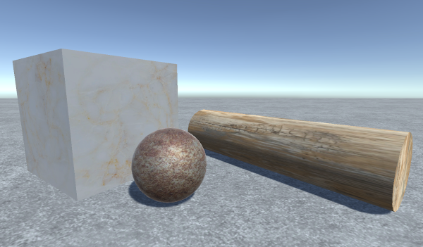

# Visual observation in Unity3D

This simple example using an agent-camera with unrestricted azimuthal moves and altitudinal restricted to the agent's front side. Using an out-of-the-box PPO trainer (ml-agents pack) the agent could be trained to detect UFOs (objects randomized is size, scale and texture) thrown in the scene. Penalized for loitering the agent learns to scan environment in a systematic way by rotating slowly in one direction, when it sees the object agent gets focused and keeps the focus till object disappears (SimpleVisualDetection scene in Assets).
 
